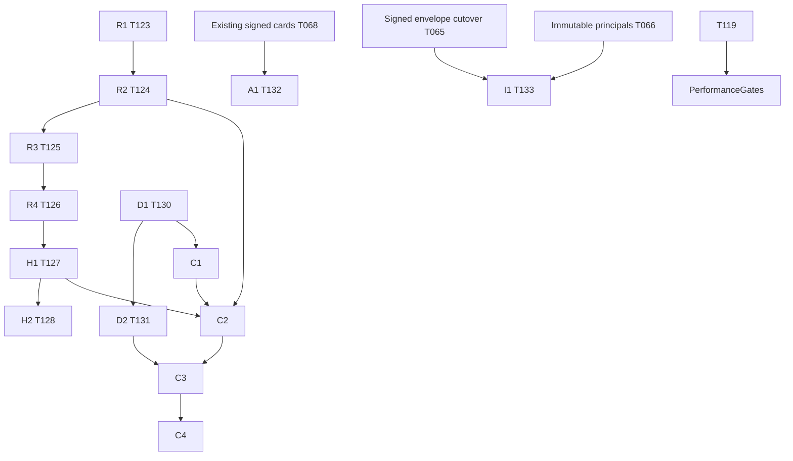

# Mailbox foundation delivery plan

## Goal

Reviewed delivery plan, updated against CLEO task records on 2026-09-30. Implementation is staged in the isolated feature/mailbox-foundation integration branch and draft PR45; it is not released. Main/live AgentMBX remains schema 2/v0.4.1 until coordinated rollout. T122 under T001 contains filed replay/history tasks T123–T128. T129 contains filed diagnostics tasks T130–T131. T132 capability preview and T133 transport semantic conformance are filed tasks under existing T062, retaining signed-card/principal prerequisites instead of duplicating them. T116 remains research coordination; T117 replay design, T118 diagnostics research, T119 baseline and T120 console research remain sourced inputs. Console C1–C4 are still future proposal labels, not filed implementation IDs.

R1/T123 is completed and staged at commit dab9c226e4e36bf94c2cfdbef8e0b127d2424bf4; D1/T130 is completed and staged. R2/T124 and D2/T131 have been dispatched from the staged foundation. T125–T128 await their recorded dependencies. T132/T133 remain gated by existing T068 and T065/T066 respectively. Task completion proves scoped evidence, not publication or whole-epic completion.

## Dependency DAG

## Steps

Small slices SHOULD target three authored files when sufficient; complete visibility writer/caller/test coverage takes precedence. R1 explicitly allows store.ts, node.ts, ledger tests and MCP rename process tests, plus any proven required caller. Generated dist/package lock artifacts are reviewed packaging output separately; if repository counts them in the limit, split build refresh into explicit packaging task rather than bypassing the budget. Test files count. Every source symbol edit requires impact inspection; unavailable graph means qualified direct source caller review.

### R1 / T123: Visibility ledger and schema migration

Dependencies: independent, after reviewed contract. Files: `src/store.ts`, `src/node.ts`, `test/replay-ledger.test.ts`.

Acceptance: Deterministic backfill and transactional visibility insertion; duplicate receipt and rename destination tests; old writers fenced.

### R2 / T124: Read-only bounded replay query

Dependencies: R1. Files: `src/node.ts`, `src/replay.ts`, `test/replay.test.ts`.

Acceptance: Stable bounded snapshot keyset; late remote/recipient grants not skipped; no ACK mutation; repeated input cursor safe.

### R3 / T125: MCP replay contract

Dependencies: R2. Files: `src/mcp.ts`, `src/replay.ts`, `test/mcp-replay.test.ts`.

Acceptance: Explicit cursor and limit validation; mailbox/filter mismatch rejected; occupied/fenced identity isolation; restart tokens work.

### R4 / T126: CLI replay and handoff guidance

Dependencies: R3. Files: `src/cli.ts`, `skill/SKILL.md`, `test/cli-replay.test.ts`.

Acceptance: CLI parity and explicit token persistence; lost token restarts safely; provider-switch walkthrough preserves mail.

### H1 / T127: Scoped signed history filters

Dependencies: T126. H1 is conceptually independent, but the actual recorded schedule is sequential after R4 to avoid concurrent edits in shared node/store/skill files. Files: `src/store.ts`, `src/node.ts`, `test/history-filters.test.ts`.

Acceptance: Signed project metadata projection unchanged; filter-before-limit; two-host/project collision and recipient privacy.

### H2 / T128: MCP handoff history filters

Dependencies: H1. Files: `src/mcp.ts`, `skill/SKILL.md`, `test/mcp-history.test.ts`.

Acceptance: Handoff convention and task/session references searchable; tags never transfer lease/authority; no signature rewrite.

### D1 / T130: Read-only diagnostic adapter

Dependencies: independent, after reviewed contract. Files: `src/diagnostics.ts`, `src/identity-status.ts`, `test/diagnostics.test.ts`.

Acceptance: Exact-session bounded redacted DTO; version mismatch and unknown process evidence preserved; pending receipts unchanged.

### D2 / T131: CLI diagnostics

Dependencies: D1. Files: `src/cli.ts`, `src/diagnostics.ts`, `test/cli-diagnostics.test.ts`.

Acceptance: CLI selects exact scope; errors actionable/redacted; no automatic retry/takeover.

### C1: Loopback console authentication

Dependencies: D1. Files: `src/console-server.ts`, `src/cli.ts`, `test/console-auth.test.ts`.

Acceptance: Separate loopback listener and expiring capability; Host/Origin/cookie protections; LAN private routes absent.

### C2: Console mailbox history API

Dependencies: C1, R2, H1. Files: `src/console-server.ts`, `src/diagnostics.ts`, `test/console-history.test.ts`.

Acceptance: Owner-selected bounded history; cursor/visibility protections; reads preserve states.

### C3: Standalone console views

Dependencies: C2, D2. Files: `console/index.html`, `console/app.js`, `console/style.css`.

Acceptance: Accessible identity/thread/delivery/receipt views; no remote assets or mutation controls; unknown stays uncertain.

### C4: Console packaging and browser verification

Dependencies: C3. Files: `src/setup.ts`, `test/console-ui.test.ts`, `scripts/build-sea.mjs`.

Acceptance: Packaged assets in npm/SEA; bounded refresh and shutdown; keyboard navigation and launch smoke.

### A1 / T132: Local capability discovery projection

Dependencies: T068 signature-verified native cards. Files: `src/discovery.ts`, `src/cli.ts`, `test/discovery.test.ts`.

Acceptance: Depends existing native signed cards; pinned schemas, expiry/trust validation; no executable interface claim or URL fetch.

### I1 / T133: CLEO transport semantic conformance

Dependencies: T065 and T066. Extend existing T063 conformance evidence for eventual T071 production integration; no duplicate factory adapter or principal implementation. Filed scope: `test/conduit-transport.test.ts`, `test/fixtures/conduit-contract.ts`, `src/conduit-contract.ts`.

Acceptance: Depends immutable authenticated principal cutover; accepted/delivered/ACK/completion independent and duplicate events idempotent.

## Phases and rollback

Phase 0: independently challenge contracts, fetch/deduplicate existing planning, run T119 baseline and capture test fixtures. Phase 1: replay ledger/API plus diagnostic CLI in separate worktrees; scoped history follows T126 sequentially because its edits share files. Phase 2: owner console after stable query/auth adapters. Phase 3: local discovery preview and CLEO semantic conformance after signed-card/principal prerequisites. Portable project namespace/topic subscriptions remain a dedicated design increment: first filtered history must not promise shared-room delivery.

Recorded execution chain: T123 → T124 → T125 → T126 → T127 → T128. Diagnostics chain: T130 → T131. Discovery preview T132 depends T068. Conformance T133 depends T065 and T066; T071 production readiness remains independently gated. Proposed console C1 depends T130, C2 depends C1/T124/T127, C3 depends C2/T131, C4 depends C3; those labels require future reviewed filing. Temporary batch files are historical creation inputs, not current authority.

Schema migration MUST run with backup and transactional backfill, preserve signed envelopes and ACK states, and fence incompatible old writers. Rollback first stops new writers/daemon/connectors and restores the coherent backup plus old binaries; it MUST NOT drop the ledger live or preserve an old cursor against restored sequence state. Rotate replay epoch on intentional restore. Non-schema CLI/UI releases can roll back independently only when schema capability checks permit. No rollback deletes mail, leases or uncertain receipt evidence. Package/SEA smoke and four-platform release matrix remain required before tag publication.

## Performance and verification gates

T119 measured synthetic macOS baselines: 100k outbox sender count 18.748 ms to 0.389 ms with sender index; pending poll 22.602 ms to 0.001 ms candidate JSON partial index; fresh process scan about 25 ms versus cached 0.000125 ms. These are measured fixtures, not cross-platform/concurrent-writer/wake/WAL guarantees. T121 sender index is independently integrated; do not redo that work. T119 baseline supplies measured thresholds; each query slice records fixture/hardware/query-plan parity and compares sparse/deep pages. Release needs correctness matrix in mailbox-foundation-integration plus full suite/typecheck/dist and SEA smoke. UI tests separately prove loopback access boundary, CSP/Origin defenses, keyboard flow and no implicit ACK. Invalidated cursor recovery, process restart and provider switch require process tests. This plan is metadata, not a new runtime verification run. T123 evidence is recorded in manifest T123-implementation-20260930040951: 12 focused ledger regressions, broader 37 focused tests, two full-suite exit-zero runs, typecheck/build/check-dist and independent review; existing Conduit TODO is still unsupported, not production conformance. T130 evidence remains its separate scoped task/manifest. Remaining query, MCP, CLI, packaging and provider restart gates must still run before release.

## Cursor and rollout boundaries

The ledger records first-ever visibility for each mailbox/message pair. Late first grants receive new sequence positions; a rename back to a previously seen mailbox does not mint another grant. Current canSee and lease checks are always authoritative, and historical replay after reactivation requires explicit rewind. R2 must test this policy. Cursor frames are unsigned, versioned pagination data with bounded validation and exact store epoch/mailbox/filter/snapshot scope; they never authorize access. Deliberately selecting a later validated position is possible for an authorized caller; no-skips means following returned continuations, not arbitrary client rewinds/advances. Tokens contain no bodies, credentials or project paths.

Schema-3 migration is confined to temporary homes until coordinated rollout. Stop/reconnect daemon and every provider MCP writer before migrating; retained schema-2 visibility INSERT writers fail closed via a connection-local version function, including statements prepared before migration. Compatible ACK/metadata updates are outside that guard boundary. Fresh CLI installed-version evidence does not prove an already-running connector version; diagnose exact provider/session binding and preserve unknown values. Restore requires coherent backup, stopped writers and explicit epoch rotation; no drop-ledger live rollback. Completion of T123/T130 is not a schema rollout receipt.

## Sources

CLEO canonical replay-topics-source-audit, local-console-source-audit, interop-framework-source-audit, and mailbox-foundation-integration. Pinned upstream/license provenance is retained in those documents. Prior delivery attachment 4ed2927a-4f07-4429-9873-a24ae4b6868d, SHA256 2c74602340a6bd5078188f5d27c9e23facff63b64dd8b12e66ccb763487fc861, is retained as historical proposal. Current task CLI records T123–T128/T130–T133 were fetched on 2026-09-30; current status here is a dated snapshot, not an automatic live projection. This plan vendors no upstream code.

## Owners

Root orchestrator owns deduplication, independent review and filing. Atomic implementation workers own scoped code and test evidence. Release owner owns integration and four-platform verification. Filed task records and dispatch receipts now identify implementation ownership; root remains integration/release owner. This metadata correction does not publish, merge main, initialize a live schema-3 database or claim all delivery phases complete.

Packaging verification uses actual npm scripts `check-dist`, `build:sea` and `smoke:sea` with scripts/build-sea.mjs and scripts/smoke-sea.mjs. New UI assets require explicit SEA embedding/static retrieval design; they are not automatically bundled by existence in console/. CLI npm package.files must include them separately if outside existing dirs.
