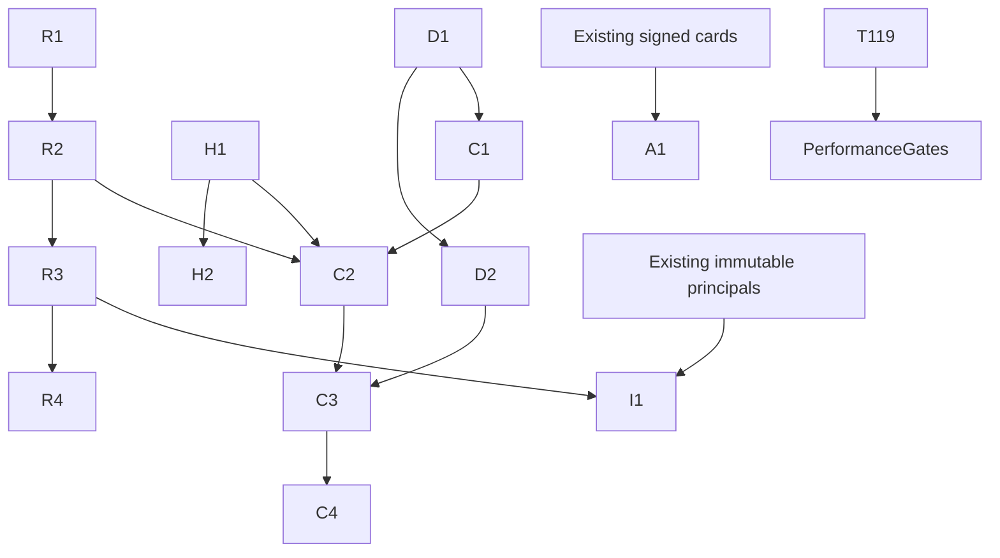

# Mailbox foundation delivery plan

## Goal

Proposal only. Source research is complete; product implementation awaits independent review. Task IDs below are proposal labels, not filed records. Implementation epic T122 under T001 contains only R1/R2/R3/R4/H1/H2 replay and scoped history. Diagnostics stays T118 until deduplicated implementation epic. Console and discovery/CLEO integration require separate later delivery epics; T116 remains source research coordination, not a container for all product releases. Existing T063/T065/T066/T068/T071 signed identity/card/group tasks MUST be fetched and deduplicated before filing A1/I1 or portable topic work. T117 covers replay design, T118 diagnostics, T119 baseline, T120 console. T116 coordinates delivery.

## Dependency DAG

## Steps

Small slices SHOULD target three authored files when sufficient; complete visibility writer/caller/test coverage takes precedence. R1 explicitly allows store.ts, node.ts, ledger tests and MCP rename process tests, plus any proven required caller. Generated dist/package lock artifacts are reviewed packaging output separately; if repository counts them in the limit, split build refresh into explicit packaging task rather than bypassing the budget. Test files count. Every source symbol edit requires impact inspection; unavailable graph means qualified direct source caller review.

### R1: Visibility ledger and schema migration

Dependencies: independent, after reviewed contract. Files: `src/store.ts`, `src/node.ts`, `test/replay-ledger.test.ts`.

Acceptance: Deterministic backfill and transactional visibility insertion; duplicate receipt and rename destination tests; old writers fenced.

### R2: Read-only bounded replay query

Dependencies: R1. Files: `src/node.ts`, `src/replay.ts`, `test/replay.test.ts`.

Acceptance: Stable bounded snapshot keyset; late remote/recipient grants not skipped; no ACK mutation; repeated input cursor safe.

### R3: MCP replay contract

Dependencies: R2. Files: `src/mcp.ts`, `src/replay.ts`, `test/mcp-replay.test.ts`.

Acceptance: Explicit cursor and limit validation; mailbox/filter mismatch rejected; occupied/fenced identity isolation; restart tokens work.

### R4: CLI replay and handoff guidance

Dependencies: R3. Files: `src/cli.ts`, `skill/SKILL.md`, `test/cli-replay.test.ts`.

Acceptance: CLI parity and explicit token persistence; lost token restarts safely; provider-switch walkthrough preserves mail.

### H1: Scoped signed history filters

Dependencies: independent, after reviewed contract. Files: `src/store.ts`, `src/node.ts`, `test/history-filters.test.ts`.

Acceptance: Signed project metadata projection unchanged; filter-before-limit; two-host/project collision and recipient privacy.

### H2: MCP handoff history filters

Dependencies: H1. Files: `src/mcp.ts`, `skill/SKILL.md`, `test/mcp-history.test.ts`.

Acceptance: Handoff convention and task/session references searchable; tags never transfer lease/authority; no signature rewrite.

### D1: Read-only diagnostic adapter

Dependencies: independent, after reviewed contract. Files: `src/diagnostics.ts`, `src/identity-status.ts`, `test/diagnostics.test.ts`.

Acceptance: Exact-session bounded redacted DTO; version mismatch and unknown process evidence preserved; pending receipts unchanged.

### D2: CLI diagnostics

Dependencies: D1. Files: `src/cli.ts`, `src/diagnostics.ts`, `test/cli-diagnostics.test.ts`.

Acceptance: CLI selects exact scope; errors actionable/redacted; no automatic retry/takeover.

### C1: Loopback console authentication

Dependencies: D1. Files: `src/console-server.ts`, `src/cli.ts`, `test/console-auth.test.ts`.

Acceptance: Separate loopback listener and expiring capability; Host/Origin/cookie protections; LAN private routes absent.

### C2: Console mailbox history API

Dependencies: C1, R2, H1. Files: `src/console-server.ts`, `src/diagnostics.ts`, `test/console-history.test.ts`.

Acceptance: Owner-selected bounded history; cursor/visibility protections; reads preserve states.

### C3: Standalone console views

Dependencies: C2, D2. Files: `console/index.html`, `console/app.js`, `console/style.css`.

Acceptance: Accessible identity/thread/delivery/receipt views; no remote assets or mutation controls; unknown stays uncertain.

### C4: Console packaging and browser verification

Dependencies: C3. Files: `src/setup.ts`, `test/console-ui.test.ts`, `scripts/build-sea.mjs`.

Acceptance: Packaged assets in npm/SEA; bounded refresh and shutdown; keyboard navigation and launch smoke.

### A1: Local capability discovery projection

Dependencies: independent, after reviewed contract. Files: `src/discovery.ts`, `src/cli.ts`, `test/discovery.test.ts`.

Acceptance: Depends existing native signed cards; pinned schemas, expiry/trust validation; no executable interface claim or URL fetch.

### I1: CLEO transport semantic conformance

Dependencies: R3. Files: `src/conduit-adapter.ts`, `test/conduit-transport.test.ts`, `skill/SKILL.md`.

Acceptance: Depends immutable authenticated principal cutover; accepted/delivered/ACK/completion independent and duplicate events idempotent.

## Phases and rollback

Phase 0: independently challenge contracts, fetch/deduplicate existing planning, run T119 baseline and capture test fixtures. Phase 1: replay ledger/API plus diagnostic CLI; scoped history in parallel. Phase 2: owner console after stable query/auth adapters. Phase 3: local discovery preview and CLEO semantic conformance after signed-card/principal prerequisites. Portable project namespace/topic subscriptions remain a dedicated design increment: first filtered history must not promise shared-room delivery.

R1 depends reviewed source contract; R2 depends R1; R3 depends R2; R4 depends R3; H1 independent after reviewed filters; H2 depends H1. T122 task batch /tmp/agentmbx-t122-task-batch.json contains only valid creation fields and no temporary-ID dependencies; attach actual returned IDs after root filing.

Schema migration MUST run with backup and transactional backfill, preserve signed envelopes and ACK states, and fence incompatible old writers. Rollback first stops new writers/daemon/connectors and restores the coherent backup plus old binaries; it MUST NOT drop the ledger live or preserve an old cursor against restored sequence state. Rotate replay epoch on intentional restore. Non-schema CLI/UI releases can roll back independently only when schema capability checks permit. No rollback deletes mail, leases or uncertain receipt evidence. Package/SEA smoke and four-platform release matrix remain required before tag publication.

## Performance and verification gates

T119 measured synthetic macOS baselines: 100k outbox sender count 18.748 ms to 0.389 ms with sender index; pending poll 22.602 ms to 0.001 ms candidate JSON partial index; fresh process scan about 25 ms versus cached 0.000125 ms. These are measured fixtures, not cross-platform/concurrent-writer/wake/WAL guarantees. T121 sender index is independently integrated; do not redo that work. T119 baseline supplies measured thresholds; each query slice records fixture/hardware/query-plan parity and compares sparse/deep pages. Release needs correctness matrix in mailbox-foundation-integration plus full suite/typecheck/dist and SEA smoke. UI tests separately prove loopback access boundary, CSP/Origin defenses, keyboard flow and no implicit ACK. Invalidated cursor recovery, process restart and provider switch require process tests. No runtime tests claimed by this plan.

## Sources

CLEO canonical replay-topics-source-audit, local-console-source-audit, interop-framework-source-audit, and mailbox-foundation-integration. Pinned upstream/license provenance is retained in those documents. This plan vendors no upstream code.

## Owners

Root orchestrator owns deduplication, independent review and filing. Atomic implementation workers own scoped code and test evidence. Release owner owns integration and four-platform verification. No implementation task is assigned or filed by this proposal.

Packaging verification uses actual npm scripts `check-dist`, `build:sea` and `smoke:sea` with scripts/build-sea.mjs and scripts/smoke-sea.mjs. New UI assets require explicit SEA embedding/static retrieval design; they are not automatically bundled by existence in console/. CLI npm package.files must include them separately if outside existing dirs.
